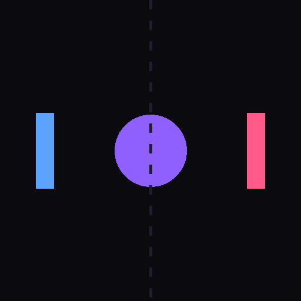

# PONG - Two Player Classic

A modern, mobile-optimized Progressive Web App (PWA) implementation of the classic Pong game.



## Features

- 🤖 **Single-player mode** - Play against an AI opponent
- 🎮 **Two-player mode** - Play with a friend on the same device
- 📱 **Mobile-optimized** - Touch controls with split-screen for two players
- 🖥️ **Desktop support** - Mouse and keyboard controls
- 🌐 **Progressive Web App** - Install on your phone like a native app
- 🔌 **Offline capable** - Play even without internet connection
- 🎨 **Modern design** - Neon aesthetics with smooth animations

## Play Now

**[Play Online](https://joeykills.github.io/pong/)**

Or install as an app on your iPhone:
1. Open the link above in Safari
2. Tap Share → "Add to Home Screen"
3. Tap "Add"

## Controls

### 1 Player Mode
- **Mobile**: Drag on left side to control your paddle
- **Desktop**: W/S keys or mouse movement (left side)
- CPU automatically controls the right paddle

### 2 Player Mode
- **Mobile (Touch)**
  - Left half of screen - Player 1 (blue)
  - Right half of screen - Player 2 (pink)
- **Desktop**
  - Player 1: W/S keys or mouse (left side)
  - Player 2: Arrow Up/Down or mouse (right side)

**Start**: Click/tap anywhere or press Spacebar

## Gameplay

- First player to **7 points** wins
- Ball speed increases slightly with each paddle hit
- Particle effects on collisions and scoring

## Installation

### As a Progressive Web App

See [PWA-INSTALL.md](PWA-INSTALL.md) for detailed installation instructions.

### Run Locally

```bash
# Clone the repository
git clone https://github.com/JoeySkills/pong.git
cd pong

# Start a local server
python3 -m http.server 8080

# Open in browser
open http://localhost:8080/index.html
```

## Tech Stack

- Pure HTML5 Canvas - No frameworks
- Service Workers for offline functionality
- Progressive Web App manifest
- Responsive design with dynamic scaling

## Files

- `pong.html` - Main game file (self-contained)
- `manifest.json` - PWA configuration
- `service-worker.js` - Offline caching
- `icon-192.png`, `icon-512.png` - App icons

## License

MIT License - Feel free to use and modify!

## Credits

Built with Claude Code
